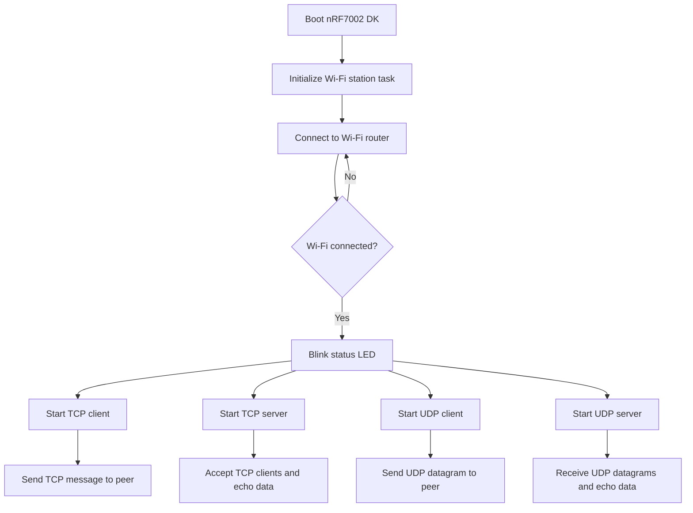

# nRF7002 DK TCP/UDP BSD Sockets Example

<div align="center">

**TCP client, TCP server, UDP client and UDP server example for the Nordic Semiconductor nRF7002 DK using Zephyr BSD sockets.**

Build a Wi-Fi 6 embedded networking application with the **nRF7002 DK**, the **nRF5340 host processor**, the **nRF Connect SDK** and the Zephyr networking stack.

<br>

[](https://www.nordicsemi.com/Products/nRF7002)
[](https://www.nordicsemi.com/Products/Development-hardware/nRF7002-DK)
[](https://www.nordicsemi.com/Products/nRF5340)
[](https://www.zephyrproject.org/)
[](https://docs.zephyrproject.org/latest/connectivity/networking/api/sockets.html)
[](https://en.wikipedia.org/wiki/C_(programming_language))

[Read the full technical article](https://abluethinginthecloud.com/nrf7002-dk-bsd-socket-examples/) ·
[Getting started with nRF7002](https://abluethinginthecloud.com/getting-started-with-nrf7002/) ·
[Visit A Blue Thing In The Cloud](https://abluethinginthecloud.com/) ·
[YouTube channel](https://www.youtube.com/@abluethinginthecloud)

</div>

---

## Overview

This repository contains a practical **BSD sockets networking example for the Nordic nRF7002 DK**.

The firmware configures the board as a **Wi-Fi station**, connects it to a Wi-Fi access point and then runs four independent networking tasks in parallel:

| Mode | Protocol | Role | Behavior |
|---|---|---|---|
| **TCP Client** | TCP | Client | Connects to a remote TCP server and sends a sample message |
| **TCP Server** | TCP | Server | Accepts TCP clients and echoes received messages |
| **UDP Client** | UDP | Client | Sends a sample datagram to a remote UDP server |
| **UDP Server** | UDP | Server | Receives UDP datagrams and echoes them back |

This project is a useful starting point for embedded Wi-Fi products that need raw TCP/UDP communication, local network protocols, industrial sockets, device-to-device communication or cloud gateway connectivity.

---

## Why this example is useful

Many Wi-Fi IoT products need direct socket-level communication before adding higher-level protocols such as MQTT, HTTP, CoAP or custom binary protocols.

This example helps you understand how to:

- Connect the **nRF7002 DK** to a Wi-Fi network.
- Use Zephyr's networking stack with **BSD sockets**.
- Create TCP and UDP clients.
- Create TCP and UDP echo servers.
- Run several network tasks in parallel.
- Configure DHCP or static IPv4 addressing.
- Test socket communication from a PC using TCP/UDP client tools.
- Use the nRF7002 as a Wi-Fi connectivity solution for embedded C applications.

---

## Application flow



---

## Repository structure

```text
nrf7002-bsd-sockets-example/
├── src/
│   ├── main.c
│   └── Task/
│       ├── Led.c
│       ├── Led.h
│       ├── TCP_Client.c
│       ├── TCP_Client.h
│       ├── TCP_Server.c
│       ├── TCP_Server.h
│       ├── UDP_Client.c
│       ├── UDP_Client.h
│       ├── UDP_Server.c
│       ├── UDP_Server.h
│       ├── Wifi_Stationing.c
│       ├── Wifi_Stationing.h
│       └── deviceInformation.h
├── CMakeLists.txt
├── Kconfig
├── prj.conf
└── README.md
```

---

## Hardware requirements

| Component | Description |
|---|---|
| **nRF7002 DK** | Nordic Semiconductor development kit with nRF7002 Wi-Fi companion IC and nRF5340 host SoC |
| **Wi-Fi access point** | Router or access point with network connectivity |
| **Development PC** | Used to build, flash and test TCP/UDP connections |
| **USB cable** | For programming, power and serial logs |
| **TCP/UDP test software** | For example Docklight Scripting, Packet Sender, netcat, Python scripts or similar tools |

The nRF7002 DK is designed for low-power Wi-Fi development and combines the nRF7002 Wi-Fi 6 companion IC with an nRF5340 host processor.

---

## Software requirements

You need a working Nordic / Zephyr development environment.

Recommended tools:

- **nRF Connect SDK**
- **Zephyr west tool**
- **nRF Command Line Tools**
- **nRF Connect for Desktop**
- **Visual Studio Code with the nRF Connect extension**, or another Zephyr-compatible workflow
- A TCP/UDP testing tool, such as:
  - Docklight Scripting
  - Packet Sender
  - netcat
  - Python socket scripts
  - Wireshark for packet inspection

For the full Nordic setup process, see:

[Getting started with nRF7002](https://abluethinginthecloud.com/getting-started-with-nrf7002/)

---

## Configuration

Before building the firmware, edit:

```text
prj.conf
```

This file contains Wi-Fi credentials, security configuration, network settings and Zephyr networking options.

---

### Wi-Fi station configuration

Set your Wi-Fi credentials:

```conf
CONFIG_STA_SAMPLE_SSID="YOUR_WIFI_SSID"
CONFIG_STA_SAMPLE_PASSWORD="YOUR_WIFI_PASSWORD"
```

Select the Wi-Fi security mode used by your router. For example, WPA2:

```conf
CONFIG_STA_KEY_MGMT_WPA2=y
```

Other available options in this project include:

```conf
# CONFIG_STA_KEY_MGMT_NONE=y
# CONFIG_STA_KEY_MGMT_WPA2_256=y
# CONFIG_STA_KEY_MGMT_WPA3=y
```

Enable only the option that matches your Wi-Fi network.

> **Security note:** never commit real Wi-Fi credentials to a public repository. Use local overlays, ignored configuration files or environment-specific configuration when adapting this example.

---

### Remote peer IPv4 configuration

The TCP client and UDP client send data to the IPv4 address configured here:

```conf
CONFIG_NET_CONFIG_PEER_IPV4_ADDR="192.168.1.201"
```

Replace it with the IP address of the PC, server or device that will receive the TCP/UDP client messages.

---

### Board IPv4 configuration

By default, the project can use DHCP:

```conf
CONFIG_NET_DHCPV4=y
```

When DHCP is enabled, the router assigns the board IPv4 address.

For a static IPv4 setup, disable DHCP and configure the board address, netmask and gateway:

```conf
# CONFIG_NET_DHCPV4=n
CONFIG_NET_CONFIG_MY_IPV4_ADDR="192.168.1.99"
CONFIG_NET_CONFIG_MY_IPV4_NETMASK="255.255.255.0"
CONFIG_NET_CONFIG_MY_IPV4_GW="192.168.1.1"
```

Use an IP address that belongs to your local network and is not already used by another device.

---

## Default ports

The example defines the default TCP and UDP ports in:

```text
src/Task/deviceInformation.h
```

| Task | Default port |
|---|---:|
| TCP Client | `504` |
| TCP Server | `4242` |
| UDP Client | `503` |
| UDP Server | `4243` |

You can modify these values in `deviceInformation.h` if your test setup uses different ports.

---

## Getting started

### 1. Clone the repository

```bash
git clone https://github.com/abluethinginthecloud/nrf7002-bsd-sockets-example.git
cd nrf7002-bsd-sockets-example
```

### 2. Configure Wi-Fi and IP settings

Edit `prj.conf` and configure:

- Wi-Fi SSID
- Wi-Fi password
- Wi-Fi security mode
- Remote peer IPv4 address
- DHCP or static IPv4 address for the board

### 3. Build the firmware

From a terminal with the nRF Connect SDK environment initialized:

```bash
west build -b nrf7002dk_nrf5340_cpuapp .
```

### 4. Flash the board

```bash
west flash
```

### 5. Open the serial console

Use your preferred serial terminal to monitor the board logs.

Typical options include:

- nRF Terminal
- PuTTY
- Tera Term
- minicom
- screen

### 6. Test the socket examples

After the board connects to Wi-Fi, the LED status task starts blinking and the TCP/UDP tasks become active.

Use your PC to create TCP and UDP sessions that match the board configuration.

---

## Testing the TCP and UDP modes

### TCP Client test

The board connects to the configured peer IPv4 address and TCP client port, then sends a sample TCP message.

PC-side example using netcat:

```bash
nc -l 504
```

Make sure your PC IP address matches:

```conf
CONFIG_NET_CONFIG_PEER_IPV4_ADDR="YOUR_PC_IP_ADDRESS"
```

---

### TCP Server test

The board listens for TCP client connections and echoes received messages.

PC-side example using netcat:

```bash
nc BOARD_IP_ADDRESS 4242
```

Type a message and check that the board echoes it back.

---

### UDP Client test

The board sends a UDP datagram to the configured peer IPv4 address and UDP client port.

PC-side example using netcat:

```bash
nc -u -l 503
```

---

### UDP Server test

The board listens for UDP datagrams and echoes received messages.

PC-side example using netcat:

```bash
nc -u BOARD_IP_ADDRESS 4243
```

Type a message and check that the board sends it back.

---

## Main files to study

| File | Purpose |
|---|---|
| `src/main.c` | Initializes Wi-Fi, LED, TCP client, TCP server, UDP client and UDP server tasks |
| `src/Task/Wifi_Stationing.c` | Handles Wi-Fi station connection and connection status |
| `src/Task/Led.c` | Toggles LED0 when Wi-Fi is connected and sockets are ready |
| `src/Task/TCP_Client.c` | Implements TCP client socket creation, connection and message sending |
| `src/Task/TCP_Server.c` | Implements TCP server socket creation, listening, accept and echo behavior |
| `src/Task/UDP_Client.c` | Implements UDP client datagram transmission |
| `src/Task/UDP_Server.c` | Implements UDP server receive and echo behavior |
| `src/Task/deviceInformation.h` | Defines default ports and shared Wi-Fi connection context |
| `prj.conf` | Zephyr, Wi-Fi, TCP/IP, DHCP, socket and memory configuration |
| `Kconfig` | Application-level configuration options for Wi-Fi station settings |
| `CMakeLists.txt` | Zephyr build setup and source file list |

---

## How the application is organized

The application starts all tasks from `main.c`:

```c
Task_Wifi_Stationing_Init();
Task_Toggle_Led_Init();
Task_TCP_Client_Init();
Task_TCP_Server_Init();
Task_UDP_Client_Init();
Task_UDP_Server_Init();
```

Each socket mode is implemented in its own module. This makes the example easy to study, modify or reuse in another nRF Connect SDK project.

The TCP and UDP tasks wait until the Wi-Fi station context reports that the board is connected before creating or using sockets.

---

## Customizing the project

### Change the TCP/UDP ports

Edit:

```text
src/Task/deviceInformation.h
```

Update:

```c
#define TCP_CLIENT_PORT 504
#define TCP_SERVER_PORT 4242
#define UDP_CLIENT_PORT 503
#define UDP_SERVER_PORT 4243
```

---

### Change the TCP client message

Edit:

```text
src/Task/TCP_Client.c
```

Look for the TCP client sample message and replace it with your own payload.

---

### Change the UDP client message

Edit:

```text
src/Task/UDP_Client.c
```

Replace the sample UDP datagram with your own payload.

---

### Add an application protocol

This repository is a low-level socket example. A typical next step is to build an application protocol on top of TCP or UDP.

Possible protocol ideas:

- Binary sensor telemetry
- JSON messages
- Custom command/response protocol
- Industrial gateway protocol
- Local discovery protocol
- UDP broadcast or multicast discovery
- TCP framing layer with message length and checksum

---

## Production considerations

For a production Wi-Fi IoT device, consider adding:

- Secure credential provisioning
- Avoiding committed credentials in `prj.conf`
- TLS for TCP-based cloud connections
- Exponential reconnection backoff
- Watchdog supervision
- Persistent configuration storage
- Network time synchronization
- Application-layer framing and validation
- Error counters and diagnostics
- Firmware update mechanism
- Power profiling and sleep strategy
- Static analysis and MISRA-C oriented cleanup

---

## Troubleshooting

### The board does not connect to Wi-Fi

Check that:

- The SSID and password are correct.
- The selected security mode matches your router.
- The Wi-Fi network is available and within range.
- The nRF7002 DK is correctly powered and flashed.
- The serial log does not report authentication or association errors.

### The board connects to Wi-Fi but TCP/UDP tests do not work

Check that:

- The board and PC are on the same network.
- Your PC firewall allows inbound TCP/UDP traffic.
- The configured peer IPv4 address is correct.
- The ports used by the PC tool match the values in `deviceInformation.h`.
- You are using TCP tools for TCP tests and UDP tools for UDP tests.
- DHCP has assigned the expected board IP address, or the static IP is valid.

### The TCP client cannot connect

Check that:

- A TCP server is listening on the PC before the board tries to connect.
- `CONFIG_NET_CONFIG_PEER_IPV4_ADDR` points to the PC running the server.
- The server is listening on the same port defined by `TCP_CLIENT_PORT`.
- Your firewall is not blocking incoming TCP connections.

### The UDP server receives nothing

Check that:

- UDP packets are sent to the board IP address.
- The destination port matches `UDP_SERVER_PORT`.
- The PC and board are on the same subnet or the router allows traffic between them.
- Your test tool is sending UDP, not TCP.

### The build fails

Check that:

- Your nRF Connect SDK environment is correctly installed.
- You are building for `nrf7002dk_nrf5340_cpuapp`.
- The board definition exists in your installed SDK.
- Zephyr and Nordic SDK versions are compatible with the nRF7002 DK.
- The project is located inside a valid west workspace or your environment variables are configured correctly.

---

## Related resources

- [Technical article: nRF7002 DK BSD Socket Examples](https://abluethinginthecloud.com/nrf7002-dk-bsd-socket-examples/)
- [Getting started with nRF7002](https://abluethinginthecloud.com/getting-started-with-nrf7002/)
- [nRF7002 MQTT Client Example](https://abluethinginthecloud.com/nrf7002-mqtt-client-example/)
- [Firmware development services](https://abluethinginthecloud.com/services/firmware-development/)
- [PCB design services](https://abluethinginthecloud.com/services/pcb-design/)
- [A Blue Thing In The Cloud website](https://abluethinginthecloud.com/)
- [A Blue Thing In The Cloud on YouTube](https://www.youtube.com/@abluethinginthecloud)

---

## About A Blue Thing In The Cloud

[A Blue Thing In The Cloud](https://abluethinginthecloud.com/) is an electronics engineering company focused on **embedded firmware development**, **PCB design**, **wireless connectivity** and **IoT product development**.

We help companies design and develop connected electronic products, from early prototypes to production-ready embedded systems.

If you are developing a Wi-Fi IoT device, an nRF7002 product, a TCP/UDP embedded application, an industrial gateway or a custom embedded system, feel free to contact us:

[Contact A Blue Thing In The Cloud](https://abluethinginthecloud.com/contact/)

---

## Keywords

`nrf7002` · `nrf7002-dk` · `nrf7002dk` · `nrf5340` · `nrf-connect-sdk` · `zephyr` · `zephyr-rtos` · `bsd-sockets` · `tcp` · `udp` · `tcp-client` · `tcp-server` · `udp-client` · `udp-server` · `wifi` · `wi-fi-6` · `nordic-semiconductor` · `embedded-c` · `iot` · `wireless` · `socket-programming` · `embedded-networking`

---

## License

This repository does not currently include a top-level open-source license file. Before using this code in a commercial product, review the licensing terms of the Nordic / nRF Connect SDK components and contact [A Blue Thing In The Cloud](https://abluethinginthecloud.com/contact/) if you need clarification.
